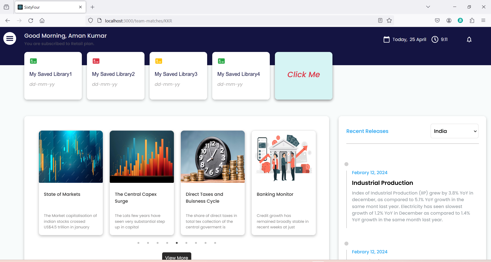
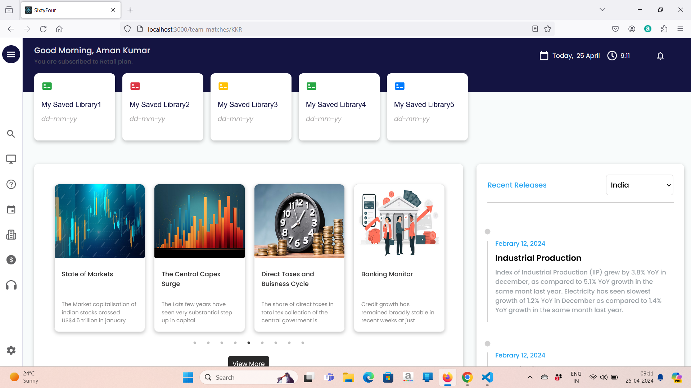
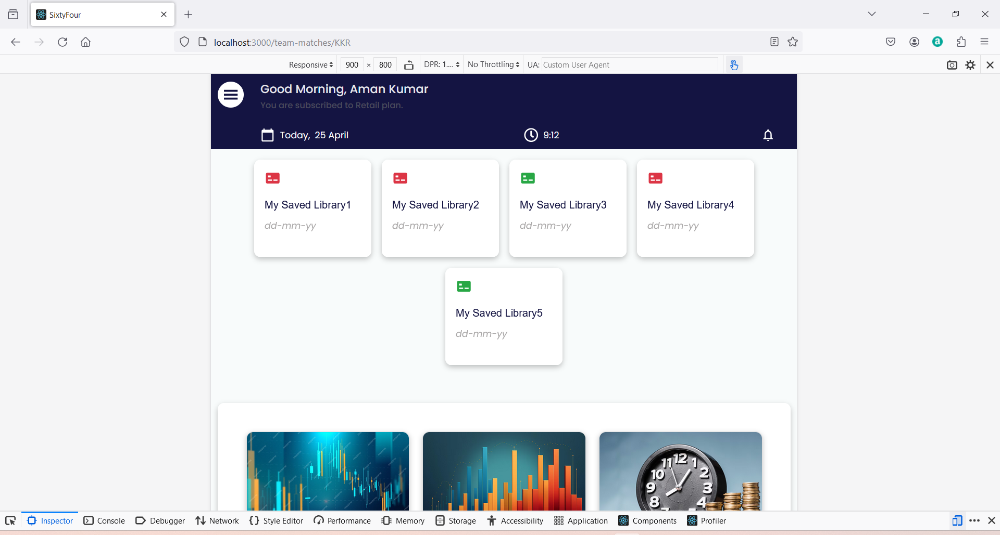
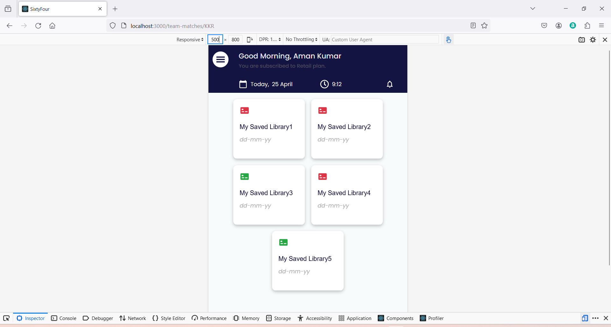
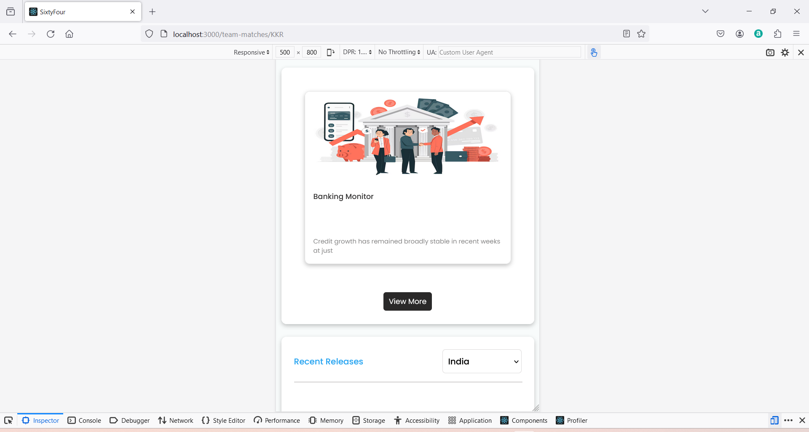
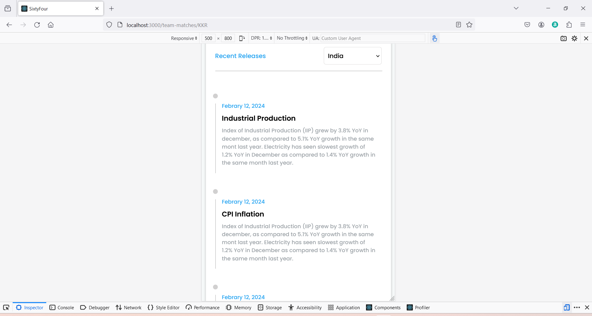

# SixtyFour Data Intelligence LLP Assignment

This is an fronted assignment. It is an responsive web page. user can load more data using view more button and user gets the live time and date with a greeting message, and can collaps the side bar, etc.

## Screen Shorts

- Large Device and Extra Large Devices

- Medium Device

- Small Device

## Components Structure

- Home.js -> home component contains all other componets and render the UI like Header, LibraryCard, CardSlider etc.

- Header.js -> It holds the Side Bar that can be collaps and current date and time is also render and flip back library cards.

- CardSlider.js -> this is an card slider dine by using React Slick. user can display multyple CardSlider by clicking on View More button.

- RecentReleases -> it holdes the timeline based on selected option.

## About

This is an fronted assignment. It is an responsive web page. user can load more data using view more button and user gets the live time and date with a greeting message, and can collaps the side bar, etc.

## Demo
click on this link to watch the demo -> https://amansixtyfour.netlify.app/

## Technologies Used

List the technologies, libraries, and frameworks used in your project. For example:
- React
- React Slick
- React Icons 
- Rect Hooks
- Bootstrap
- CSS Animations, etc.

## Features

- Feature 1: I have build a timer logic thats render the current date and time
- Feature 2: I have made side bard that a user can collaps.
- Feature 3: When a user mouse over on the library card it show flip animation.
- Feature 4: When a user change the device width acording to device width it becomes responsive.
- Feature 5: When a user click on View More button then multipal Slider renders as per choise.
- etc.

## Installation

install all the dependencies using 'npm install'
run the application using 'npm start'

